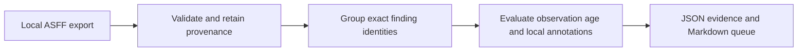

# Security Findings Workbench

Turn an AWS Security Hub findings export into a reproducible triage queue with source identities, owners, observation-age checks, and expiring exceptions.

**Independent portfolio project · Python standard library · offline · synthetic demo data**

Security work often becomes a spreadsheet of similar-looking findings. This project keeps the evidence needed to decide which records are duplicates, which need an owner, and which suppressed findings need another look.

## Run the demo

Python 3.10 or newer; no package installation or cloud credentials needed. From this directory:

```sh
python3 workbench.py examples/findings.json --annotations examples/annotations.json --as-of 2026-10-08T12:00:00Z --format markdown
python3 -m unittest -v
```

The fixture contains five records representing four distinct findings. It demonstrates a repeated snapshot, reported exploit availability, an expired exception, a stale observation, and a source record marked resolved. Inspect the committed [Markdown output](examples/report.md), [JSON evidence](examples/report.json), and [tests](test_workbench.py).

## Design decisions



- Finding identity is `(ProductArn, Id)`. A shared CVE or resource does not merge two findings.
- Select the most recent provider `UpdatedAt`; equal-time conflicting snapshots receive an explicit warning. The deterministic tie-break does not prove which conflicting state is correct.
- `LastObservedAt` supplies observation freshness. A recent record update does not make an old observation fresh. Missing observation time stays unknown.
- An active exception needs an owner, reason, ticket reference, and future expiration. A suppressed finding with missing or expired evidence returns to review.
- Preserve original source indexes in the JSON report. Source `RESOLVED` or `ARCHIVED` status is never represented as independently verified remediation.

These field distinctions follow the [AWS identifier reference](https://docs.aws.amazon.com/securityhub/1.0/APIReference/API_AwsSecurityFindingIdentifier.html), [required attributes](https://docs.aws.amazon.com/securityhub/latest/userguide/asff-required-attributes.html), and [optional attributes](https://docs.aws.amazon.com/securityhub/latest/userguide/asff-top-level-attributes.html).

## Inputs and policy

The export must contain a `Findings` array. The optional annotations file is a list keyed by `ProductArn` and `Id`; see [the example](examples/annotations.json). No tags or company names are used to invent ownership.

The sample SLA policy is deliberately illustrative: Critical 3 days, High 7, Medium 30, Low/Informational 90, measured from `CreatedAt`. It is not an employer policy, regulatory requirement, or recommendation for every organization. `--stale-days` defaults to 14. `--as-of` is mandatory so the same input produces the same answer.

Exit `0` means all rows passed this tool's limited input validation; it does not mean the environment is secure. Exit `2` indicates an input error or invalid records. Valid records still appear when other individual records are invalid. Unmatched annotations are reported.

## Boundaries

This is a local demonstration, not a complete ASFF validator, scanner, ticketing integration, exploitability assessment, or approved production triage system. It does not call AWS, resolve findings, change suppression state, or attest that a vulnerability has been fixed. Export completeness and observation timestamps require verification against the source system. Local files are loaded into memory; large-export streaming and signed provenance are future work.

Reports preserve finding and resource identifiers and may be sensitive when using real exports. Use approved data-handling processes; only the synthetic fixtures in this repository are intended for public sharing. Markdown output escapes embedded HTML, links, images, and table delimiters.

Developed with AI assistance and verified with local tests. GitHub CI is provided but must run after publication before a passing remote check can be claimed.

## Contributing

Open an issue describing the input shape and expected result, using synthetic records. Add a regression test for behavior changes and run `python3 -m unittest -v`. Keep the runtime dependency-free and the tool offline. Do not add employer exports, credentials, or personal data.
